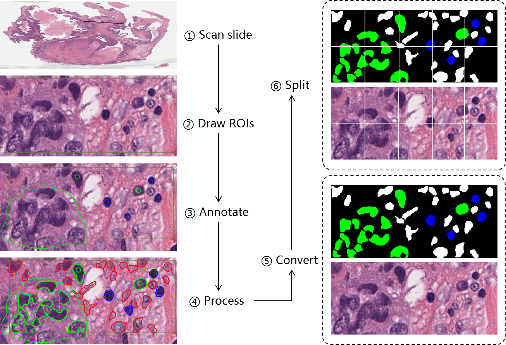
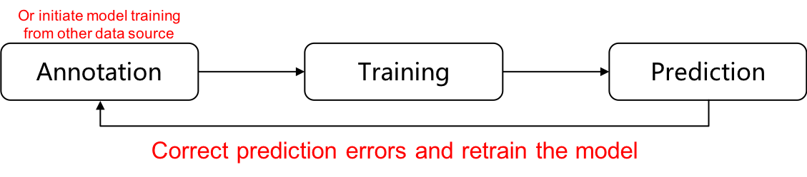

# QuPathScripts
 This repo contains QuPath scripts for 
   * QuPath annotation processing, so as to match the requirements for downstream analysis.
   * Import image mask to QuPath, so as to enable data visualization and correction.
## QuPath cell annotation pipeline

### Important steps for annotation and processing
1. Scan slides. Magnification set to 20x or 40x (pixel size 0.5μm or 0.25μm)
2. Draw ROIs (Follow our annotation plan), and run the code (processROIs.groovy) to fine adjust the size of ROIs to meet the requirements of patch extraction.
3. Annotate Cells/Regions (Follow our annotation plan)
4. Run the code (processAnnotations.groovy) to process the annotations, detect cells and assign the labels to cells
5. Run code to convert annotations into specific formats  
    * [option 1] into multi-label masks. (run createCellMask.groovy)   
    * [option 2] into single label with cell individuals. (TODO: maybe Python code based on the upper step is easier)
6. Divide images and masks from large ROIs into smaller patches.
    * (TODO: python code is needed)

## Online Learning with QuPath as visualization and interaction interface
Online learning is an important way to improve model performance. One essential part of this learning strategy is a friendly visualization 
and interaction system, which allows annotators/experts to observe prediction results and correct errors in them. 
Rather than recreating wheels, we wrote some script to import data into QuPath, so as to borrow QuPath's visualization and interaction system.

### Important steps for import data into QuPath
1. Get the data you would like to import. 
Currently, our code supports multi-label mask images in a folder. You also need to define the association of each cell type to colors.
2. Run code to import data. (load_mask.groovy)

## References
1. Create working environment for advance QuPath scripting    
    https://github.com/qupath/qupath/wiki/Advanced-scripting-with-IntelliJ

 

