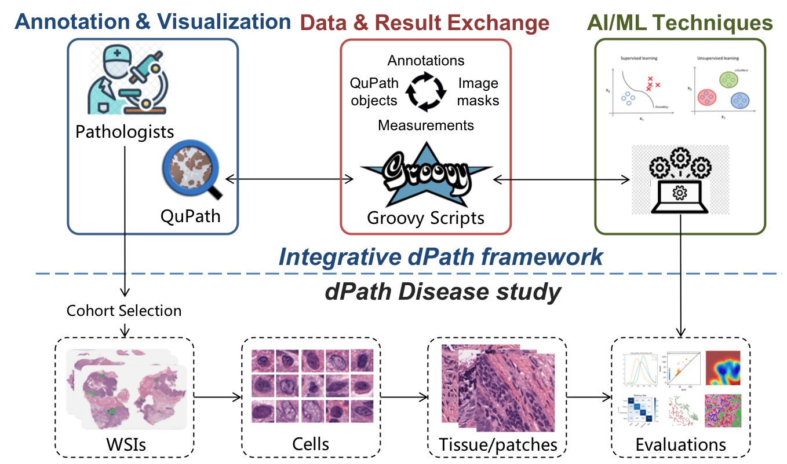

# Cellular Composition
Code in this repo is used to evaluate technical feasibility of using digital pathological approaches to facilitate objective and scalable diagnosis screening for Serous borderline ovarian tumor (SBOT) and high-grade serous ovarian cancer (HGSOC).
However, the workflow we developed in this work can be easily extended to other cellular analysis.
You can get more information from our [paper]() and [Youtube video]().

Figure 1. The proposed workflow for cellular analysis.
## cite our work
```
author = {Jiang, Jun. and Tekin, Burak. and Guo, Ruifeng. and Liu, Hongfang. and Huang, Yajue. and Wang, Chen.},
title =  {{Digital pathology-based study of cell- and tissue-level morphologic features in serous borderline ovarian tumor and high-grade serous ovarian cancer}},
journal  ={Journal of Pathology Informatics},
volume ={12},
number ={1},
pages  = {24},
doi  = {10.4103/jpi.jpi_76_20},
year  = {2021}
}
```
